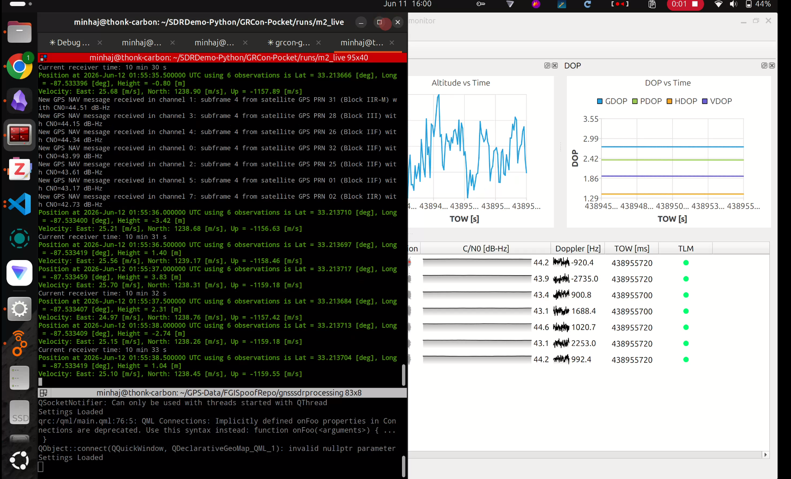

# gr-pocketsdr

GNU Radio out-of-tree (OOT) module for the
[Pocket SDR](https://github.com/tomojitakasu/PocketSDR) FE 2CH/4CH/8CH
open-source GNSS RF frontends (MAX2771 + Cypress EZ-USB FX2LP/FX3). The front-end used for this developed was DataGNSS PocketSDR FE 4CH ([link](https://www.datagnss.com/products/pocketsdr-gnss-receiver), not sponsored).

> [!NOTE]
> **New Update:** Changes has been merged with [GNSS-SDR](https://github.com/gnss-sdr/gnss-sdr) upstream (`next` branch). Jump here - [Use as a GNSS-SDR Signal Source](#use-as-a-gnss-sdr-signal-source)


Provides a `PocketSDR Source` block that streams the FE's 2-bit IF samples over USB and outputs one `gr_complex` stream per selected RF channel.

Developed and tested on Ubuntu 24.04 / GNU Radio 3.10.9. Tested in linux only (libusb-1.0).

## Dependencies

```sh
sudo apt install gnuradio-dev cmake build-essential pkg-config \
                 libusb-1.0-0-dev pybind11-dev
```

## Build and install

```sh
git clone <this repo> gr-pocketsdr
cd gr-pocketsdr
mkdir build && cd build
cmake -DCMAKE_INSTALL_PREFIX=<prefix> ..   # omit prefix for /usr/local
make -j$(nproc)
ctest                # bit-exact unpack regression test (no hardware needed)
make install         # may need sudo for system prefixes
```

For a non-system prefix, make sure the environment can find the module:

```sh
export LD_LIBRARY_PATH=<prefix>/lib:<prefix>/lib/x86_64-linux-gnu:$LD_LIBRARY_PATH
export PYTHONPATH=<prefix>/lib/python3.12/site-packages:$PYTHONPATH
export GRC_BLOCKS_PATH=<prefix>/share/gnuradio/grc/blocks
```

## Device permissions (udev)

The FE enumerates as Cypress `04b4:00f1` (FX3, FE 4CH/8CH) or `04b4:1004` (FX2LP, FE 2CH). If the device node is not accessible as a regular user, install a udev rule (as root):

```
# /etc/udev/rules.d/99-pocketsdr.rules
SUBSYSTEM=="usb", ATTR{idVendor}=="04b4", ATTR{idProduct}=="00f1", MODE="0666", ATTR{power/control}="on"
SUBSYSTEM=="usb", ATTR{idVendor}=="04b4", ATTR{idProduct}=="1004", MODE="0666", ATTR{power/control}="on"
```

then `sudo udevadm control --reload && sudo udevadm trigger`.
`power/control=on` disables USB autosuspend, which can otherwise interrupt
streaming. Plug the FE directly into a USB 3.0 port (no hub/dock).

## Usage

Configure the device with a standard PocketSDR configuration file: either
beforehand with PocketSDR's `pocket_conf`, or by pointing the block's
*Config File* parameter at one (same format; e.g.
`PocketSDR/conf/pocket_L1L5_20MHz.conf`). An empty *Config File* keeps the
device's current settings.

*Channels* is a list of 1-based RF channel numbers, one complex output per
entry — `[1]` for a single L1 stream, `[1, 2]` for coherent dual-band.

Example flowgraph: `examples/pocketsdr_psd.grc` (live L1 spectrum with a
QT GUI Frequency Sink).

Python:

```python
from gnuradio import pocketsdr
src = pocketsdr.pocketsdr_source('', [1])
src.get_sample_rate()   # Hz, read back from the device
src.get_center_freq(0)  # LO of the first selected channel, Hz
src.overruns()          # samples-lost counter, 0 in a healthy run
```

## Use as a GNSS-SDR signal source
This was the primary motivation for building this project. Check out the example folder.



The PocketSDR signal source has been merged with the `next` branch of [gnss-sdr](https://github.com/gnss-sdr/gnss-sdr/tree/next). The documentation to build gnss-sdr with the gr-pocketsdr support has been updated here - [Link](https://gnss-sdr.org/docs/sp-blocks/signal-source/#implementation-pocket_sdr_signal_source). 

```
git clone https://github.com/gnss-sdr/gnss-sdr
cd gnss-sdr
git checkout next
mkdir build && cd build
cmake -DCMAKE_PREFIX_PATH=<gr-pocketsdr install prefix> -DENABLE_POCKETSDR=ON ..
make -j$(nproc)
sudo make install
```

## Tests

`ctest` runs a bit-exact regression test: a captured raw FE 4CH USB stream
(`tests/data/raw_slice.bin`) is unpacked by this module and compared
byte-for-byte against reference files generated by PocketSDR's own
`pocket_dump` unpack code (`tests/gen_reference.c`). No hardware is needed.


## License and attribution

GPLv3 (see `LICENSE`). The USB/device/unpack layer in `lib/` is adapted
from the PocketSDR C library, Copyright (c) 2021-2026, T. Takasu, BSD
2-clause license (see `LICENSE.PocketSDR`); adapted files carry both
notices.
